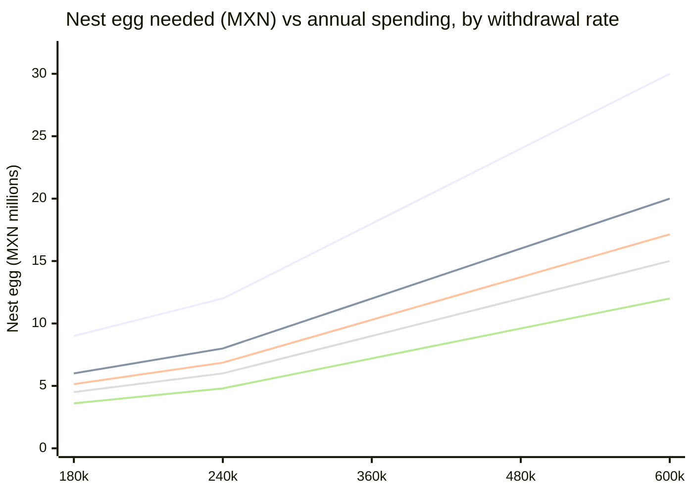
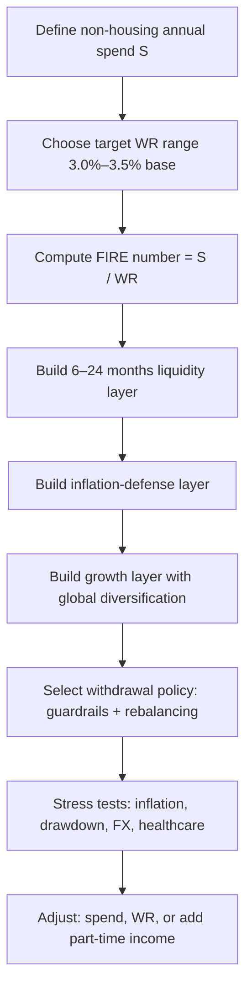
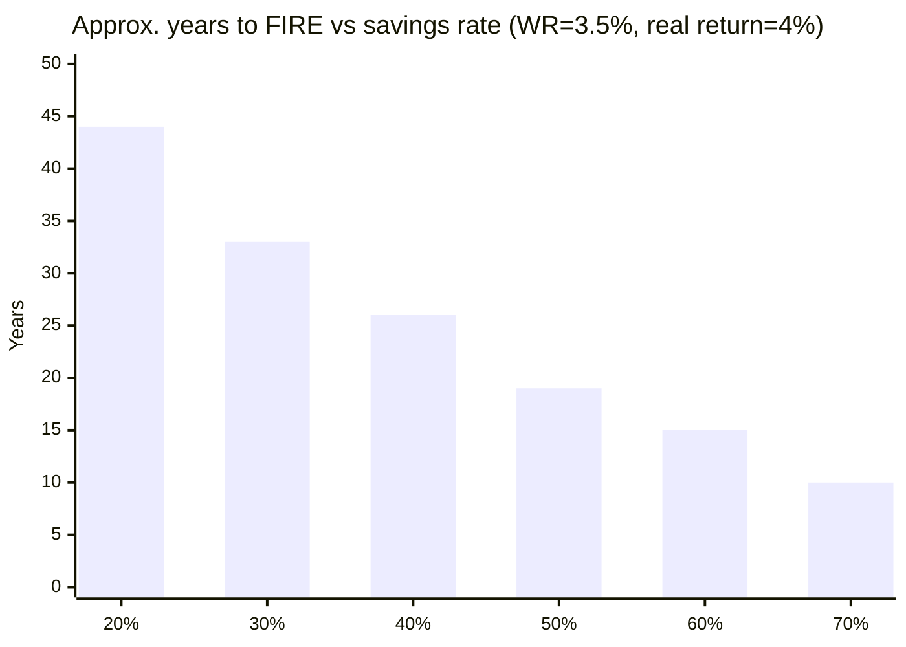

# FIRE in Mexico for a Middle-Class Resident

## Executive summary

Achieving FIRE (financial independence / retire early) in Mexico is often more feasible than in many high-cost countries **if** you manage three Mexico-specific risks carefully: (a) inflation that can spike and hit essentials (especially food and healthcare), (b) a portfolio that is too concentrated in pesos or too concentrated in Mexico, and (c) health and long-term-care uncertainty, where one major medical event can dominate lifetime spending. Mexico’s policy framework also creates a distinctive opportunity: **high nominal yields on government securities** can support a conservative “liability-matching” layer (CETES/Bonos/UDIBONOS), while global equity exposure (often via the SIC) can hedge long horizons and currency uncertainty. citeturn21view0turn10search8turn4search11turn4search15

Because you stated **housing is already covered**, this report treats **rent/mortgage = 0** in FIRE spending and focuses on non-housing living costs (utilities, food, transport, healthcare, taxes, discretionary) plus **home upkeep reserves** (maintenance, HOA/condominium fees, insurance, property tax if applicable). This single assumption materially lowers the required “FIRE number,” and also reduces regional cost differences—housing is usually the biggest regional driver. citeturn20view1turn7search5turn7search11

Using Mexico spending data as a baseline and adjusting for regional price levels, a realistic **middle-class, housing-covered** non-housing budget often lands around:

- **Single:** ~MXN **16k–25k/month** (moderate) and **25k–40k/month** (comfortable)  
- **Couple:** ~MXN **24k–38k/month** (moderate) and **38k–60k/month** (comfortable)  

Those ranges already include utilities/communications, food (groceries + modest dining), transport, healthcare coverage assumptions, and discretionary spending; they exclude rent/mortgage but do include typical “keep-the-home-running” costs. citeturn20view2turn7search5turn11search23

From there, the nest-egg target depends mostly on (1) your annual spending and (2) the withdrawal rate you can defend under long horizons. Academic and practitioner research shows why early retirees generally should not treat “4%” as a universal constant: the original 4% lineage used a ~30-year horizon (U.S. historical data), while FIRE horizons can be ~40–50 years. citeturn5search0turn5search9turn12view1turn5search2

A rigorous Mexico-appropriate approach is to plan across a **2%–5%** range and then “earn” the higher end only if you adopt (a) low fees, (b) global diversification, and (c) flexible spending rules (guardrails/dynamic withdrawals). Vanguard’s FIRE-focused Monte Carlo work (50-year horizon, 85% success criterion) illustrates this spectrum: **~2.6%** under restrictive assumptions (domestic-only, high fees, rigid inflation spending) versus **~4.0%** with global diversification, low fees, and dynamic spending. citeturn12view1turn12view0

**Recommended planning stance (housing covered):** anchor your “base FIRE” at **3.0%–3.5%** and treat **4.0%** as an *earned* rate requiring a resilient portfolio + flexible spending and/or supplemental income. citeturn12view1turn5search36turn5search37

---

## Assumptions and methodology

This report cannot tailor a single “correct” FIRE number because your age, current savings, income, risk tolerance, and desired retirement age are unspecified. Instead, it provides (a) explicit baseline assumptions that you can swap out, and (b) sensitivity tables/diagrams showing how results move.

### Core assumptions used in the examples

Housing status:
- **Shelter cost (rent/mortgage):** **MXN 0** (per your instruction)  
- **Home operating costs:** included (utilities + maintenance reserves + insurance/fees), because “housing covered” rarely means “housing has zero annual cash needs.” citeturn20view1turn21view0

Inflation and macro context:
- Baseline inflation context comes from Mexico’s CPI: **annual inflation ~4.6% (first half of March 2026)** with notable category dispersion (e.g., **food** much higher than headline in that release). citeturn21view0  
- Monetary policy transmission matters because high rates lift yields on government securities but also affect growth and risk assets. citeturn1search1turn14search37  
- Scenario context for FX and inflation trajectory: BBVA Research expects headline inflation to close 2026 around **3.9%** and a **gradual MXN depreciation** toward ~18 MXN/USD by end-2026 (forecast, not a guarantee). citeturn14search3turn14search7  

Withdrawal-rate framing:
- Foundational SWR research: Bengen (historical safe withdrawal framing) and Trinity-style portfolio success work. citeturn5search0turn5search9  
- Long-horizon and international caution: Pfau’s findings that U.S.-centric historical success can overstate safety in other markets/time periods. citeturn5search2turn5search10  
- Flexibility tools: guardrails (Guyton–Klinger style) and sequence-of-returns risk framing. citeturn5search36turn5search37  

### What “middle class” means here

Mexico has no single universally accepted “middle class” cutoff; for a practical FIRE planning anchor, this report uses a distributional approach: **middle deciles of household income**. In ENIGH-E 2022, household income deciles V–VIII are roughly **MXN 45,700 to 80,134 per quarter** (national averages, 2022). citeturn19view0

Because you are single, your personal income may not map cleanly to household deciles; the point is to ground “middle class” in an official distribution rather than a vague label. citeturn19view0turn20view1

---

## Mexico cost-of-living without housing

### Inflation trend and why it matters for FIRE

Mexico’s CPI release for the first half of March 2026 shows:
- Headline inflation: **4.63% y/y**
- Core inflation: **4.46% y/y**
- Non-core inflation: **5.18% y/y**
- Category variation is substantial; for that release, **Food & non-alcoholic beverages** shows a much higher annual rate than headline. citeturn21view0

For FIRE planning, this matters because essential categories (food, healthcare, utilities) can inflate differently than “headline,” so a portfolio plan that only targets headline inflation can fail in lived experience. citeturn21view0turn5search37

### Baseline spending structure from official household expenditure data

Official expenditure data from the entity["organization","Instituto Nacional de Estadística y Geografía","statistics agency, mexico"] (ENIGH-E 2022) provides a useful *structure* for non-housing budgets:

Average household **monetary current expenditure per quarter** (MXN):
- Total: **40,906**
- Food, beverages, tobacco: **14,167**
- Transport and communications: **8,377**
- Housing and services: **3,741** (note: in ENIGH categories, this includes utilities/energy and housing services; it is not the same as “rent”)  
- Personal care: **3,323**
- Education and recreation: **3,270**
- Home cleaning/care: **2,619**  
…and additional categories (clothing, health, transfers). citeturn20view2turn20view1

Urban vs rural differences are large:
- Urban monetary current expenditure: **44,850 per quarter**
- Rural monetary current expenditure: **28,180 per quarter**  
This is roughly a **0.63x** ratio rural-to-urban for the “average household basket.” citeturn20view0turn20view1

Because your housing is covered, the main ways you’ll diverge from these averages are:
- Being a **single-person “household”** (different economies of scale),
- Choosing **private vs public healthcare strategy**, and
- Choosing **car-heavy vs transit-heavy** mobility. citeturn11search23turn21view0

### Regional non-housing cost multipliers and budgets

City-to-city cost-of-living differences shrink once housing is removed, but they do not disappear. Crowd-sourced indices are imperfect yet directionally helpful when combined with official spending structure. Using Numbeo’s “cost of living excluding rent” comparisons as a **relative multiplier**:

- Mexico City vs Guadalajara: Mexico City is ~**10% higher** excluding rent. citeturn7search5  
- Mexico City vs Monterrey: Monterrey is ~**8% higher** excluding rent (while rent tends to be lower, which is irrelevant here). citeturn7search11  
- Mexico City vs Mérida: Mérida is ~**9% lower** excluding rent. citeturn7search19  
- Mexico City vs Puerto Vallarta: Puerto Vallarta is **higher** excluding rent (tourism/amenity pricing), even though rent differentials can vary. citeturn8search12turn8search0  

These are best used as *scenario multipliers*, not as gospel. citeturn7search5turn7search11

#### Practical monthly non-housing budgets (MXN), housing covered

Assumptions:
- Utilities + communications included (electricity/water/gas/internet/cell).  
- Transport assumes either transit-first or modest car usage; heavy car use can add several thousand MXN/month depending on commute, insurance, fuel, maintenance.  
- Healthcare shown as two strategies: public-first (with private out-of-pocket) vs private-insurance-first. citeturn21view0turn11search23turn11search8  

**Table: Monthly non-housing budgeting ranges (MXN)**

| Region bucket | Single – lean | Single – moderate | Single – comfortable | Couple – moderate | Notes (big drivers) |
|---|---:|---:|---:|---:|---|
| Mexico City | 13k–18k | 16k–25k | 25k–40k | 24k–38k | Dining out + transport + private healthcare tilt drive variance. citeturn7search4turn21view0 |
| Guadalajara | 12k–17k | 15k–23k | 23k–36k | 23k–35k | Slightly lower non-housing price level vs Mexico City. citeturn7search5 |
| Monterrey | 13k–19k | 17k–27k | 26k–42k | 26k–41k | Non-housing costs can run higher (services/food), even if rent lower. citeturn7search11 |
| Smaller interior city (example: entity["city","Mérida","yucatan, mexico"] / entity["city","Santiago de Querétaro","queretaro, mexico"]) | 11k–16k | 14k–22k | 21k–33k | 21k–34k | Often lower “baseline” costs; car dependence may increase transport. citeturn7search19turn8search3 |
| Coastal / tourist areas (example: entity["city","Puerto Vallarta","jalisco, mexico"] / entity["city","Cancún","quintana roo, mexico"]) | 14k–20k | 18k–30k | 30k–50k | 28k–48k | Food/dining and services often priced for tourism; seasonality is real. citeturn8search0turn8search1turn8search12 |
| Rural / low-cost towns | 9k–14k | 12k–18k | 18k–28k | 18k–28k | Official data show much lower average spending rural vs urban, but transport/health access can be harder. citeturn20view1turn11search3 |

### Healthcare cost components you must plan for

Public options and “public + private” mixes matter for FIRE, because medical risk is fat-tailed.

- entity["organization","Instituto Mexicano del Seguro Social","public health insurer, mexico"] offers voluntary incorporation paths. One IMSS voluntary incorporation page lists an **annual cost of MXN 20,538.59 effective Feb 1, 2026** (program-specific; confirm eligibility and what it covers for your status). citeturn11search23  
- CONDUSEF’s materials highlight out-of-pocket medical spending risk (and provide tools like a GMM simulator). Their public info cites an average annual amount spent on consultation/treatment in the thousands of pesos (older baseline), which is exactly why catastrophic coverage matters even if “average spending” looks manageable. citeturn11search1turn11search25  
- Private major medical insurance premiums vary heavily by age, plan design, deductible, and network. A large Mexican bank’s consumer guidance gives a wide national range (e.g., **~MXN 10k to 100k+** depending on factors), illustrating how quickly healthcare can dominate a FIRE budget at older ages. citeturn11search8turn11search10  

---

## Nest-egg targets, withdrawal rates, and stress tests

### The FIRE number is arithmetic first

Let:
- **S = annual spending** in MXN (excluding rent/mortgage; including utilities, food, transport, healthcare, discretionary, and a home-maintenance reserve)
- **WR = initial withdrawal rate** (2%–5%)
- Then **Target portfolio (pre-tax)** ≈ **S / WR**

**Table: Target nest egg (MXN millions) by annual spending and withdrawal rate**

| Annual spending S | 2% | 3% | 3.5% | 4% | 5% |
|---:|---:|---:|---:|---:|---:|
| 180,000 | 9.0 | 6.0 | 5.14 | 4.5 | 3.6 |
| 240,000 | 12.0 | 8.0 | 6.86 | 6.0 | 4.8 |
| 360,000 | 18.0 | 12.0 | 10.29 | 9.0 | 7.2 |
| 480,000 | 24.0 | 16.0 | 13.71 | 12.0 | 9.6 |
| 600,000 | 30.0 | 20.0 | 17.14 | 15.0 | 12.0 |

These are **before** explicitly adjusting for taxes on interest/dividends/capital gains. citeturn5search0turn12view1turn10search14

### Why you should not pick one withdrawal rate blindly

Research matters because the key risk isn’t average return—it’s *bad early sequences* plus inflation.

- The original 4% framing stems from historical analysis of U.S. data (Bengen) and later portfolio-success analysis (Trinity-style). citeturn5search0turn5search9  
- International evidence suggests the U.S. historical experience can be unusually favorable and that safe rates may be lower in other contexts. citeturn5search2turn5search10  
- Sequence-of-returns risk is core for early retirees: a large drawdown early in retirement can permanently impair sustainability under fixed real spending rules. citeturn5search37  

A Mexico-resident early retiree faces an additional dimension: **currency mismatch risk** if spending is MXN but assets are partly USD/global, or vice versa. citeturn14search7turn10search8

### Monte Carlo evidence designed for FIRE horizons

The most directly FIRE-relevant evidence in your requested source set is Vanguard’s FIRE paper (Monte Carlo, 50-year retirement, 85% success benchmark). It illustrates how “safe” withdrawal rates are not purely a market-return question—they are also a **fees + diversification + spending-rule** question:

- Domestic-only, higher fees, rigid “dollar + inflation” spending → **~2.6%**  
- Add international diversification, keep high fees → **~2.8%**  
- Add international diversification, reduce fees to ~20 bps → **~3.3%**  
- Add international diversification, low fees, **dynamic spending** → **~4.0%** citeturn12view1turn12view0  

**Interpretation for Mexico:** If you aim for **3.5%–4.0%**, you are implicitly committing to:
- low all-in costs,
- globally diversified equity exposure (not Mexico-only),
- and a flexible withdrawal policy rather than “inflate last year’s spending no matter what.” citeturn12view1turn5search36turn10search8

### Scenario stress tests you should run (Mexico-specific)

Even without running your personal Monte Carlo, you can stress-test your plan with structured shocks:

**Inflation shock (essentials-led):**  
Use the CPI release’s category dispersion as the template: food and health can run well above headline. Stress test “3 years of 7%–9% essentials inflation while your portfolio returns are mediocre.” Inflation dispersion is visible in CPI sub-indices. citeturn21view0turn14search26

**Market drawdown + sequence risk:**  
Stress test a “Year 1–2 drawdown” where equities fall 30%–50% while you keep withdrawing. Sequence risk is a documented mechanism for failure under fixed real spending. citeturn5search37turn5search9

**Currency path scenarios (MXN spending, USD assets):**  
- Gradual depreciation (helpful if you own USD assets): BBVA Research explicitly models a moderate depreciation path in its macro outlook. citeturn14search3turn14search7  
- Sharp appreciation (harmful if you rely on USD assets for MXN bills): test “MXN up 20%” for 1–2 years.  
The point is not prediction; it’s ensuring your withdrawal rule can survive plausible FX volatility. citeturn14search7turn5search2

**Healthcare shock:**  
A single high-cost event can exceed many years of “average” medical spend. Pair your spending model with catastrophic coverage decisions (public access strategy vs major medical insurance). citeturn11search8turn11search14turn11search23

### Comparison chart: withdrawal rate vs nest egg

The “right” line is the one that remains survivable under your stress tests and tax reality, not the one that looks prettiest. citeturn12view1turn5search36turn5search37

---

## Mexican investment vehicles and tax rules for non-pension FIRE

### The investable toolkit in Mexico

Mexico offers a robust set of building blocks; the key is understanding *liquidity, inflation protection, and taxes*.

Government securities (via cetesdirecto / brokerages):
- Products include BONOS, BONDES, BONDDIA, and inflation-protected UDIBONOS; CETESDirecto describes these instruments and how their interest structures differ. citeturn4search11turn4search15

Equities/ETFs (Mexico and international):
- Mexico’s “Mercado Global” / SIC lets Mexican investors access foreign-listed shares and ETFs through local market infrastructure. citeturn10search8turn10search9

AFORE system (retirement accounts):
- AFORE accounts are primarily for retirement-age access, but voluntary contributions have different lockups (including deductible types that must stay invested until 65). citeturn4search18turn4search1  
- You can compare AFORES using CONSAR’s net return indicator framework. citeturn10search3turn10search7  

Brokerage platforms (examples):
- GBM markets access includes BMV/SIC and U.S. access plus retirement products like PPR (product availability changes—verify terms). citeturn10search0turn10search8  
- Actinver content explains ETFs access via brokerage contracts and the SIC for foreign equities. citeturn10search5turn10search9  

Real-estate securities:
- Mexican FIBRAs are a listed real-estate structure tracked by the S&P/BMV FIBRAS index. citeturn6search19turn6search3

### High-level tax map for a FIRE retiree living off investments

Mexico’s tax treatment is nuanced; the goal here is a *decision-useful map*, not a substitute for professional advice.

**Individual income tax brackets (ISR):**  
The official ISR tariff tables for 2026 (Anexo 8 RMF 2026) show a progressive structure ranging from low single-digit rates up to **35%** at the top bracket. citeturn9search0

**Capital gains on listed securities:**  
Gains from sale of shares on recognized exchanges have a **10%** regime under the cited legal framework (commonly applied via withholding/reporting mechanics through brokers). citeturn0search22turn10search14

**Dividends:**  
Mexico applies an additional **10%** withholding on dividends paid to individuals (as commonly summarized by brokers and aligned with LISR dividend provisions). citeturn1search2turn10search14

**Interest withholding (system financial):**  
For 2026, the “retención anual” referenced by LISR articles 54 and 135 is **0.90%** (published via the Ley de Ingresos de la Federación text). citeturn24view0turn24view1

**VAT (IVA):**  
Consumption in Mexico typically embeds VAT (general rate 16%) in prices, so it usually does not appear as a line item in your retirement budget—but it is part of your cost structure. citeturn9search9turn9search1

### Practical implications for portfolio design

A Mexico-based FIRE portfolio usually benefits from a three-layer approach:

1) **Liquidity layer (peso cash + short CETES ladder):**  
Covers 6–24 months of spending to avoid selling risky assets into drawdowns. The logic is sequence-risk mitigation. citeturn5search37turn4search11

2) **Inflation-defense layer (UDIBONOS / real assets / diversified equities):**  
UDIBONOS are explicitly designed to protect against unexpected inflation by indexing principal in UDIs and paying a real rate. citeturn4search15turn21view0

3) **Growth layer (global equities via SIC and/or foreign accounts):**  
This hedges long retirement horizons and diversifies away from Mexico-only concentration. The SIC is a core Mexico-specific mechanism enabling this without necessarily moving residence. citeturn10search8turn12view1turn5search2

---

## Income-generation strategies and expected yield logic

This section compares “how you actually fund spending” once retired. A crucial FIRE insight to challenge: **dividends are not free money**; they are one way of realizing total return. Your sustainability depends on total return, inflation, taxes, and spending flexibility—not on the label of the cash flow. citeturn5search0turn5search37

### Dividend and equity-income portfolios

Pros:
- Can provide psychologically stable cash flow and can be accessed via diversified funds/ETFs (including global high-dividend strategies).
- Equity exposure supports growth against long horizons.

Cons:
- Dividend cuts happen; concentrating in “high yield” sectors can raise risk.
- Dividend taxation applies. citeturn6search7turn10search14

Mexico implementation consideration:
- Mexican equities are represented by the S&P/BMV IPC framework; broad exposure can be achieved via local vehicles, but Mexico-only concentration is a risk. citeturn6search13turn5search2

### Bond ladders and government-securities “income”

Pros:
- Government securities are a straightforward way to lock known cash flows for near-term liabilities (especially in pesos).
- UDIBONOS provide explicit inflation linkage.

Cons:
- Reinvestment risk: “high yields now” do not guarantee high yields later.
- Interest taxation mechanics apply (including annual withholding rules). citeturn4search11turn24view0turn4search15

### Rental income and real estate

Pros:
- Real estate can match a “housing-covered” retiree’s lifestyle well if you already understand local markets.
- FIBRAs provide real-estate-linked distributions without direct property management.

Cons:
- Vacancy, maintenance, legal/regulatory headaches, and local-market concentration.
- For FIBRAs, sector cycles matter; recent performance is not a promise. citeturn6search19turn6search3turn13search3

### Annuities

Pros:
- Transfers longevity risk to the insurer (valuable if you want “can’t-outlive” income).

Cons:
- Pricing can be unattractive depending on rates and inflation assumptions; contracts are complex.
- Inflation protection is often limited or costly.

Use-case in Mexico FIRE:
- Often most rational as a *partial* hedge at older ages, after your health/longevity picture is clearer. citeturn5search37turn11search10

### Part-time work and hybrid FIRE

Pros:
- Small earned income can dramatically lower sequence risk and allow a higher initial withdrawal rate. This is consistent with dynamic spending approaches and guardrails. citeturn5search36turn12view1

Cons:
- Reduces the “RE” purity; depends on job market and personal preference.

---

## Step-by-step playbook to reach FIRE

### Step sequence

The logic is grounded in SWR research, Vanguard’s FIRE-specific Monte Carlo framing, and sequence-of-returns risk dynamics. citeturn5search37turn12view1turn5search36

### Savings-rate scenarios and expected time to FIRE

A useful “mechanical” model: If you start from zero (or ignore current savings) and earn a constant real return **r**, your time to hit a target multiple of expenses depends primarily on your savings rate.

For a 50-year-horizon FIRE plan, a conservative base might target **WR = 3.5%** (≈ 28.6× annual expenses). Under a **4% real return** assumption, time-to-FI from zero is approximately:

| Savings rate | Savings as multiple of expenses | Approx. years to FI (WR=3.5%, r=4%) |
|---:|---:|---:|
| 20% | 0.25× | ~44 years |
| 30% | 0.43× | ~33 years |
| 40% | 0.67× | ~26 years |
| 50% | 1.00× | ~19 years |
| 60% | 1.50× | ~15 years |
| 70% | 2.33× | ~10 years |

This is not a forecast; it is a planning identity showing why FIRE is more about savings rate than about picking stocks. citeturn12view1turn5search37

### Suggested glidepaths for a Mexico resident

Because actual risk tolerance is unspecified, the right approach is to offer **menu glidepaths**:

- **Conservative / capital-preservation tilt:**  
  More government securities (including inflation-linked) and shorter duration for expenses you must cover in the next 5–10 years; global equities still present for long-horizon purchasing power. citeturn4search15turn5search37turn12view1

- **Balanced FIRE (often a default):**  
  A diversified global equity core + a government bond/UDI layer sized to your “sleep at night” constraints, plus a cash/CETES runway. citeturn10search8turn12view1turn4search11

- **Aggressive early accumulation:**  
  Higher equity share early, then gradually build the bond/UDI layer as the retirement date nears to reduce sequence risk. citeturn5search37turn5search9

### Tax-efficient withdrawal sequencing in Mexico

A practical sequence (conceptual, not legal advice):

1) **Use cash/CETES runway first** in a downturn year to avoid selling equities low.  
2) **Harvest exchange-traded gains** strategically when markets are strong; Mexico’s “listed securities” tax regime is commonly summarized as 10% on gains, which can be preferable to interest taxed at higher effective rates for higher-income households. citeturn0search22turn10search14turn9search0  
3) **Hold some inflation-linked exposure** so you are not forced to “chase inflation” by selling equities into bad markets. citeturn4search15turn21view0  
4) **Treat AFORE/PPR as later-life layers** if access is age-restricted; for early retirement you typically need a “bridge portfolio” in taxable accounts. Voluntary AFORE savings types may be locked until 65 depending on the modality. citeturn4search18turn12view1  

### Contingency planning

Your plan is not complete without contingencies:

- **Emergency fund:** 6–12 months expenses in liquid instruments (more if income is variable). citeturn5search37  
- **Healthcare coverage strategy:** document your chosen policy (public-first, private insurance, or mixed) and re-evaluate every 2–3 years as age changes pricing. citeturn11search8turn11search23turn11search25  
- **Currency hedge policy:** decide what fraction of long-term assets you want in global (USD) exposure vs peso assets, consistent with your future liabilities. SIC access makes this feasible even from Mexico. citeturn10search8turn14search7turn5search2  
- **“Bad decade” protocol:** pre-commit guardrails (e.g., reduce discretionary spending 5%–15% after large drawdowns). Guardrails are a documented approach to improve sustainability. citeturn5search36turn12view1  

### One-page checklist

Define and measure:
- Track last 12 months of **non-housing spend** (MXN) and split into: utilities/communications, food, transport, healthcare, discretionary, transfers/gifts, home upkeep. citeturn20view2  
- Decide which tier you target (lean / moderate / comfortable) and whether it differs across cities.

Set targets:
- Pick a **base WR** (3.0%–3.5% suggested for long horizons) and compute **FIRE number = S / WR**; also compute 2% and 4% to see bounds. citeturn12view1turn5search0  
- Add a tax margin (especially if interest-heavy) using 2026 tax and withholding context. citeturn24view0turn9search0turn10search14  

Build the portfolio:
- Establish a 6–24 month **cash/CETES runway**. citeturn4search11turn5search37  
- Add an **inflation-defense** sleeve (UDIBONOS / real-asset exposure). citeturn4search15turn21view0  
- Add **global equity exposure** (often via SIC) for long-term purchasing power and currency diversification. citeturn10search8turn12view1  
- Keep fees low; FIRE sustainability is fee-sensitive in long horizons. citeturn12view1turn12view0  

Plan withdrawals:
- Document a guardrails-style rule and your rebalancing policy. citeturn5search36turn5search37  
- Confirm how your broker reports/withholds taxes on gains/dividends/interest, and keep annual tax filing readiness. citeturn10search14turn9search0  

Stress-test:
- Inflation shock, drawdown shock, FX shock, and healthcare shock; pre-write your actions (cut discretionary, pause inflation raises, add part-time income). citeturn21view0turn5search37turn11search8turn14search7  

### Recommended next steps

1) Build your personalized S (annual non-housing spend) from your bank/broker statements, then classify it using the ENIGH “big rubros” structure so you can see whether your plan is food-heavy, transport-heavy, or healthcare-heavy. citeturn20view2turn20view1  
2) Choose a **base WR** and a **flexible spending rule**—don’t skip this step. Vanguard’s FIRE work shows how much sustainability depends on spending flexibility and fees. citeturn12view1turn12view0  
3) Write a one-page “healthcare and catastrophic risk plan” (public + private mix) and update it every year; healthcare is where many FIRE plans silently fail. citeturn11search8turn11search23turn11search14  
4) Decide your **peso vs USD/global exposure policy** (a rule, not a vibe) so your currency risk is intentional rather than accidental. citeturn14search7turn10search8turn5search2